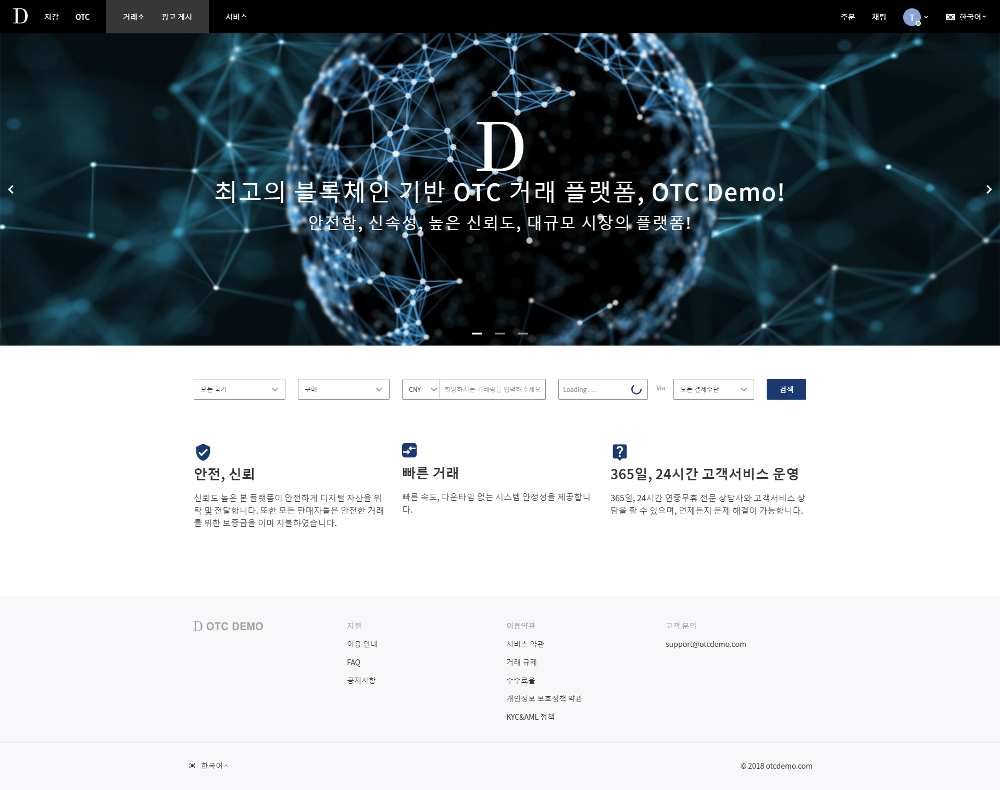
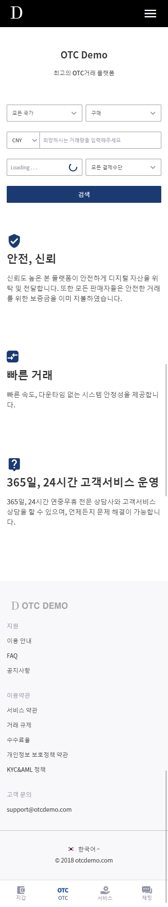

# P2P 가상화폐 거래소 프로젝트
<h2>Fornt-End</h2>
<a href="https://github.com/bisu8018/p2p_exchange_front_end/">프로젝트 소스코드 링크 (https://github.com/bisu8018/p2p_exchange_front_end/)</a>
 
<a href="https://bisu8018.github.io/">데모 사이트 링크 (https://bisu8018.github.io)</a> 
 
(현재 가데이터 작업 진행중이므로, 부분적으로 진입 불가한 페이지가 존재합니다.)
 
 
 

## 개요
- Vue js 기반 반응형 웹, P2P 가상화폐 거래소 구축
 
 
 메인페이지(Desktop 환경) 캡쳐, 
메인페이지(Mobile 환경) 캡쳐
 
 

## 담당 업무
- 프로젝트 프론트 엔드 개발 담당 (주요 기능 위주 전체 약 70%)
 
- 디자인팀이 제작한 결과물 바탕으로, common CSS/z-index/sprite 이미지 정리
 
 

## 사용 언어 및 프레임워크
- Vue js, Vuetify
 
- HTML5, CSS3
 
- JavaScript, TypeScript
 
 

## 협업 툴
- Intelij
 
- GIT
 
- JIRA
 
 

## 개발 제한사항 (프론트엔드)
- Vue js 2 사용
 
- 반응형 웹 개발 (최소 사이즈 : 아이폰5se, 태블릿 PC : 고려 X)
 
- 라이브러리 사용 최소화
 
- 멀티 브라우져 지원 (크롬, 사파리, 파이어폭스, IE Edge, IE11)
 
- 4개국어 지원 (한국어, 영어, 중국어 간체, 중국어 번체)
 
 

## 상세 내용
<h4>프로젝트 구조</h4>
<image src="images/prj_structure.png" style="width: 150px;">
   
  ① assets : fonts, images, sprite images<a href="img/sprite_image-2.232809dd.png">(이미지 보기)</a> 보관 
  ② common : Cookie 설정과 같은 프로젝트 공통 사용 함수 보관 
  ③ components : alert, date picker, select box 등등 공통 컴포넌트 보관 
  ④ config : 언어설정, url 목록 등등 설정 관련 스크립트 파일 보관 
  ⑤ service : Back-end 통신 위한 AXIOS 관련 스크립트 파일 보관 
  ⑥ views : vue 파일 보관 
  ⑦ vuex : vuex 관련 스크립트 파일 보관 
   
   
  나눈 이유 상세 설명 (vue 특징 서술) 
-  config, vue config, vuex 상세 설명 스샷 첨부 

2. 주요 기능 페이지 상세 설명
- post ad
- mypage
- coin 등록
- 거래목록 및 필터 검색
- 지갑

